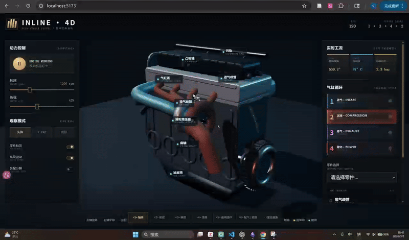
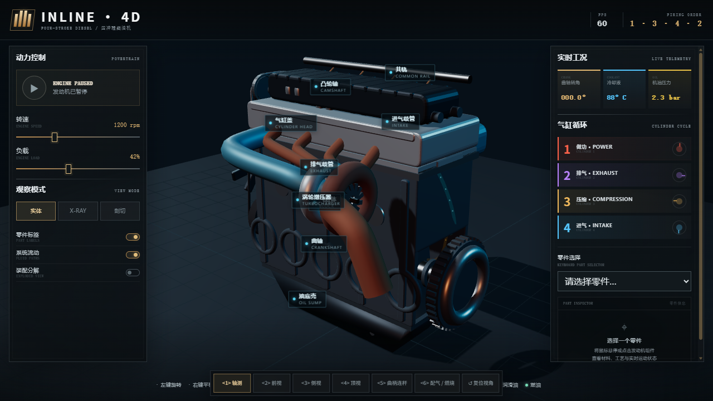
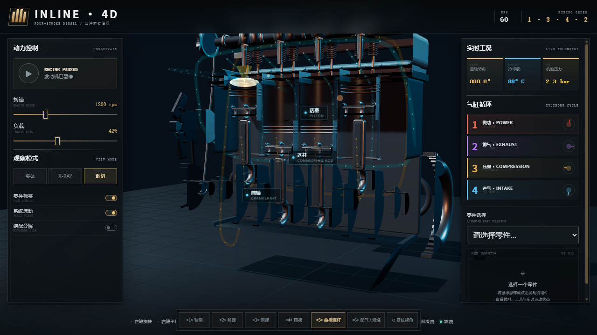

# Codex 多代理生成四缸发动机交互网页实验日志

## 1. 实验背景与目标

本实验选择复现视频所展示的主要任务形态：让 Codex 从一条自然语言需求出发，自主完成程序化三维发动机网页的架构、机械研究、建模、动画、交互、测试和迭代。最终产物是基于 Three.js 的可交互教学模型，而不是制造级 CAD，也不是 Procedura 所生成的 OpenSCAD 参数化装配体。Procedura 的复现实验应作为另一条独立研究线，不与本实验结果混为一谈。

核心研究问题如下：

1. Codex 能否从空目录和一条完整 Prompt 出发，独立生成可运行的四缸发动机交互网页？
2. 多代理审查—实现—复验能否持续提高机械可信度、视觉可读性和运行性能？
3. Codex 内部审查能否可靠发现模型缺陷？
4. 引入不依赖 LLM 的外部工具后，能否得到更可信、可复算的质量证据？

实验约束：

- 不复用其他发动机项目或现成完整模型；
- 不要求用户提供机械公式、尺寸、结构或修复答案；
- 不调用外部付费 API；
- 不租用 GPU；
- 只建立本地 Git 仓库，不创建 GitHub 仓库；
- 每一版保留独立提交或标签，不改写既有版本历史；
- 实测结果、代理判断、推断和真人待测项目必须分别表述。

## 2. 项目与实验环境

- 项目目录：`D:\ComputePicture\codex-inline4-multiagent`
- 技术栈：Vite、TypeScript、Three.js、WebGL2
- 目标硬件：Intel Arc Graphics
- 兼容路径：SwiftShader 软件渲染
- 版本管理：本地 Git，无远程仓库
- 模型定位：程序化、可编辑、浏览器实时运行的教学可视化模型

模型包含曲轴、连杆、活塞、气缸体、气缸盖、油底壳、双凸轮轴、气门与弹簧、燃油喷射、润滑、冷却、进排气和涡轮系统，并提供实体、X-Ray、剖切、分解、标签、流体路径、六个相机机位和零件检查等功能。

> 注：上述“无远程仓库”是实验执行阶段的约束。实验完成并冻结本地历史后，为便于结果展示，另行建立了 GitHub 轻量发布分支；该操作不修改 v1—v4 的实验提交及标签指向。

## 3. 总体实验流程

实验分为四个模型版本和一次独立外部测评：

1. **v1：从一句话到完整项目。** 在空目录中由 Codex 多代理从零生成网页。
2. **v2：第一次定向质量提升。** 对 v1 进行机械、视觉、性能三路只读审查，再集中修复。
3. **v3：评分驱动的质量上限探索。** 增强实际机械关系、几何细节、状态管理和性能，并进行内部独立评分。
4. **v3 外部测评：检验内部审查结论。** 使用 Lighthouse、axe-core、Blender、Trimesh 和独立碰撞扫描器重新测量，发现内部审查遗漏。
5. **v4：根据外部测评进行整改。** 修复确认的碰撞、凸轮拓扑和无障碍问题，再进行独立复验和本地快速验收。

## 4. 版本总览

| 版本 | 提交/标签 | 正式测试 | Draw Calls/帧 | 主要结果 | 阶段结论 |
| ---- | ------------------------------------------------------------- | ---------: | -----------: | ------------------------- | ------------------ |
| v1 | `5518627ae0430add55b31cd8a4c3e8fb5ab02db3` / `v1-baseline` | 14/14 | 约 682.6 | 从空目录生成完整交互网页 | 初始可运行基线 |
| v2 | `12472172925ec3108d096f2402a48e3f7939931b` / `v2-baseline` | 17/17 | 约 377.1 | 修正顶隙、喷油/燃烧、机位和阴影开销 | 第一轮系统改进 |
| v3 | `7e5ea916a115dcef1bf3ba467a31b78c6206c612` / `v3-model-final` | 22/22 | 约 269.23 | 增加正时/附件传动、实际凸轮包络、流体分支和实例化 | 内部审查阶段最高版本 |
| 外部测评 | `eccde839811d6991b9583f3c4fd6c08918ec64c1` | 不修改 `src/` | — | 发现碰撞、凸轮绕序、重复顶点和无障碍问题 | 推翻“v3 已无高优先级缺陷”的结论 |
| v4 | `4e0b7f1d7858befb167a56fdfb8609d70ea59b80` / `v4-model-final` | 28/28 | 约 269–271 | 修复测得缺陷，721 角度注册碰撞族归零 | 当前实验条件下可交付版本 |

> 注：`v3-model-final` 是被冻结的历史标签，不代表外部测评后仍将 v3 认定为最终最高质量版本。

## 5. v1：从一句话生成完整项目

### 5.1 目标与方法

在全新空目录中发送一条完整需求 Prompt，由 Codex 主代理自主规划并调度子代理。实际共使用 5 个代理，最高同时运行 4 个代理，包括主代理、架构代理、机械代理、几何代理和独立质量审查代理。通过代理复用覆盖架构、机械研究、程序化建模、界面、浏览器测试和质量审查六项职责。

该工作流使用了当时平台允许的多代理能力，但不等同于视频中的 DSH 六代理配置。

### 5.2 实现结果

- 完成 Vite、TypeScript 和 Three.js 项目架构；
- 核心几何全部由源码程序化生成；
- 实现 720° 四冲程循环和 1-3-4-2 点火顺序；
- 实现曲轴—连杆—活塞、凸轮轴和气门动画；
- 实现实体、X-Ray、剖切、分解、标签、流体和零件检查；
- 实现暂停、转速、负载、相机和实时状态界面。

### 5.3 验证与问题

- TypeScript 生产构建通过；
- 14/14 项运动学和状态测试通过；
- Edge WebGL2 页面未发现应用控制台错误、页面异常或资源错误；
- 三轮视觉审查修复首帧黑屏、界面遮挡、网络字体、窄屏重叠、相机和检查器问题；
- 当时自动环境只能使用 SwiftShader，测得约 4.38 FPS，该数据不能代表硬件 GPU 性能；
- 尚未进行完整碰撞、网格拓扑、CFD、热传导、强度或制造精度验证。

### 5.4 结论

v1 证明 Codex 能从一条完整需求和空目录出发，生成结构完整、可运行、可交互的程序化四缸发动机网页；但它只是初始基线，不能据此宣称机械或几何达到工程级精度。

总墙钟时间约 68 分钟。

录屏：


[查看原始 MP4](src/v1-vedio.mp4)

## 6. v2：第一次独立审查与定向整改

### 6.1 实验目标

保留 v1 作为受保护基线，由机械、视觉和性能三个子代理先进行只读审查，再由主代理统一修改共享状态和核心场景，最后由未参与实现的审查代理复验。

实际角色：

| 代理 | 职责 |
| --- | --- |
| `/root` | 任务组织、筛选、实现、整合和提交 |
| Pauli | 机械结构与运动学审查 |
| McClintock | 视觉与交互审查 |
| Cicero | 性能、构建和自动测试审查 |

最多同时运行 3 个子代理。用户没有提供机械设计答案，只发送了额度恢复和流程继续指令。

### 6.2 主要发现

- 活塞上止点至缸盖约 26 mm，压缩空间过大；
- 凸轮、挺柱、气门和弹簧之间的驱动关系不清；
- 喷油可视化直接跟随燃烧状态；
- 四缸共享部分可变材质，存在状态覆盖风险；
- 曲柄连杆和配气专用机位未突出核心运动链；
- X-Ray 中附件过亮，标签过于集中；
- 约 324 个 Mesh 投射动态阴影；
- 部分对象和界面文字每帧更新；
- 旧浏览器验收可能记录错误但仍返回成功。

### 6.3 实施修改

- 将活塞压缩高度设为 68.5 mm，顶隙由约 26 mm 调整为 5.5 mm；
- 将燃烧区域放置在活塞冠顶与缸盖之间；
- 按逐缸进排气事件计算凸轮相位，保持凸轮轴半速；
- 增加桶形挺柱并固定弹簧靠近缸盖的一端；
- 将喷油命令与燃烧热释放拆成独立状态；
- 为四缸分别建立喷油和燃烧材质；
- 重构曲柄连杆、配气/燃烧机位和 X-Ray 视觉层级；
- 按机位筛选标签；
- 投射阴影 Mesh 从 324 降至 6，阴影图从 2048 降至 1024；
- 界面遥测约以 12.5 Hz 更新，3D 运动继续逐帧运行；
- 增加硬断言和负向故障页面。

### 6.4 结果

- 正式测试：17/17；
- TypeScript、生产构建、SwiftShader 和 Intel Arc 浏览器验收均通过；
- 页面控制台错误、页面异常和资源错误均为 0；
- 负向页面触发 10 项失败并正确返回非零状态；
- 桌面 1280×720 和窄屏 390×844 均无页面溢出；
- Draw Calls 从约 682.6 降至约 377.1，下降约 44.8%；
- Intel Arc D3D11 约 120 FPS，p95 约 8.4 ms。

由于没有 v1 的同硬件基线，不宣称硬件 FPS 提升倍数。

### 6.5 结论

v2 提高了机械关系、内部结构可读性和渲染效率，并建立了能够拒绝错误版本的浏览器验收流程。它是第一轮系统性质量提升，不是重新生成的新网页。

录屏：


[查看原始 MP4](src/v2.mp4)

## 7. v3：评分驱动的多代理循环改进

### 7.1 实验目标

以 v2 为受保护基线，让 Codex 自主发现问题、查询权威资料、实施改进并进行独立复验。用户不提供机械结构、尺寸或修复答案。

内部评价采用六个维度的 100 分标准：机械与运动学 25、程序化几何 25、视觉与教学可读性 20、交互 10、性能 10、测试与证据 10。

### 7.2 主要改进

- 使用 quartic 升程曲线和平底挺柱支承包络重新生成凸轮；
- 将首次径向凸轮方案中约 3 mm 的干涉修正为 `0.499999–0.573884 mm` 非负间隙；
- 增加曲轴和双凸轮正时轮，以 18:36:36 表达 2:1 传动；
- 增加曲轴—水泵—风扇附件传动；
- 让喷油量随负载单调变化，并保留怠速最小喷油量；
- 增加涡轮一阶惯性视觉状态；
- 建立进气、排气、润滑和冷却的开放路径与四缸分支；
- 修复顶部相机、暗部补光和零件选中轮廓；
- 将窄屏左右面板改为默认收起、互斥打开的抽屉；
- 由 `EngineApp` 统一管理机位和显示模式；
- 使用 `InstancedMesh` 合并重复几何，同时保留 34 个可拾取系统根。

### 7.3 机械与性能验证

- 0–720° 数值扫描最大曲柄连杆闭合误差：`1.42e-13 mm`；
- 1/4 缸和 2/3 缸活塞配对最大误差：`1.14e-13 mm`；
- 活塞顶隙：5.5 mm；
- 凸轮轴/曲轴转速比：0.5；
- 凸轮—挺柱间隙：`0.499999–0.573884 mm`；
- 弹簧固定端漂移：0；
- 正式测试：22/22；
- Draw Calls：约 269.23/帧，相比 v2 再下降约 28.6%；
- 三角形：74,338，相比 v2 下降约 10%；
- Intel Arc：约 120 FPS，p95 8.4 ms；
- SwiftShader：约 11.48–12.11 FPS；
- 负向夹具能够捕获六类故障并返回退出码 1。

### 7.4 内部审查结果及其局限

内部代理将平均分由 v2 的 77.3 提高到 v3 的 90.3，并给出 P0=0、P1=0 和放行结论。当时据此将 v3 称为实验最终版本。

这一结论随后被外部测评修正：内部审查验证了运动公式、截图、交互和性能，但没有覆盖完整网格拓扑、正式无障碍流程和完整三角表面碰撞。因此，90.3 分只能视为项目内部、代理定义的比较分，不能作为外部质量认证。

### 7.5 阶段结论

v3 是内部审查条件下的阶段最高版本，显著提高了机械可读性、交互、几何组织和性能；但它不是最终无缺陷版本，也不能单独支撑“已经达到最高质量”的结论。

总墙钟时间约 9 小时 55 分；额度中断 2 次；人工流程恢复 2 次；用户提供机械答案 0 次。

录屏：


[查看原始 MP4](src/v3.mp4)

## 8. v3 独立外部测评

### 8.1 测评目的与方法

为了避免只依赖 Codex 自评，冻结 `v3-model-final`，在不修改 `src/` 的前提下增加独立测评工具和证据。测评提交为：

`eccde839811d6991b9583f3c4fd6c08918ec64c1`

自动证据覆盖 12/12 类，包含 Lighthouse、Web Vitals、持续 WebGL、Spector、axe-core、Blender、Trimesh、机械扫描、碰撞扫描和证据哈希清单。

### 8.2 测评结果

- A 性能：19.5/25；
- B 无障碍：仅完成 4/17 个已测项，NVDA 待真人，因此不发布 B/20；
- C 几何与机械：24/35；
- D 真人盲评：待完成；
- 按预注册协议不发布外部总分。

主要发现：

- 键盘无法完整进入零件检查器；
- 200% 文字缩放存在阻断性重叠；
- 焦点、选择状态、滚动区域、对比度和 landmark 存在问题；
- 约 51% 位置重复顶点，其中混合了合法接缝和可能的真实冗余；
- 16 个凸轮节点共有 2,304 条绕序错误边；
- 旧扫描在全部 721 个角度发现至少一组非白名单碰撞；
- 连杆/缸套径向代理最大异常约 21.41 mm；
- 约 107 mm 的数值属于壳体包裹代理量，不应直接解释为实体穿透深度，但后续窄相位仍确认存在真实三角表面相交。

### 8.3 测评意义

外部测评证明：v3 的机械公式正确和浏览器运行稳定，并不等于完整装配几何无碰撞。它也说明多个共享假设的代理可能形成共同盲区，因此外部工具和预注册验收门是必要的。

## 9. v4：针对外部测评的质量整改

### 9.1 目标与流程

v4 不重新生成网站，也不继续堆叠装饰，而是针对外部测评暴露的问题进行复现、分类、修复和独立复验。

工作流程包括：

1. 几何碰撞、无障碍、视觉性能三路只读审查；
2. 主代理区分真实缺陷、合理接触、壳体包裹和扫描语义限制；
3. 分模块整改并由主代理统一整合；
4. 三轮几何扫描和两轮无障碍复验；
5. 未参与相应实现的代理进行最终复验。

v4 全过程共出现 9 个实际代理角色，包括主代理和分阶段复用/新建的审查、实现代理；最大同时运行 3 个子代理。代理数量是整个 v4 过程中的实际角色总数，不表示 9 个代理同时运行。

### 9.2 几何与机械整改

- 将封闭实体块代理改为具有真实曲轴扫掠空间的开放式曲轴箱结构；
- 将实心油底壳法兰改为开放周边框架；
- 重建缸盖下部结构并保留四个真实燃烧室开口；
- 增加开放式缸套和下部定位环；
- 用曲柄配重实际扫掠半径、轴向范围和安全间隙推导缸套下边界；
- 修复两个凸轮端盖索引循环，使 16 个凸轮节点绕序错误归零；
- 不缩小或隐藏运动零件，不扩展冻结碰撞白名单；
- 保持 720° 循环、1-3-4-2 点火顺序、曲柄连杆闭合和凸轮半速关系。

几何修复经历三轮：

1. 第一轮打开缸体后，仍发现曲柄/定位环、曲柄/油底壳和活塞/缸盖相交，未放行；
2. 第二轮打开油底壳和缸盖后，仍发现配重/定位环和配重/开放缸套相交，未放行；
3. 第三轮把曲柄配重的轴向范围纳入解析间隙约束，最终通过。

### 9.3 无障碍与交互整改

- 增加可由键盘访问的 18 类语义零件选择器；
- 零件选择器、检查器和 3D 高亮双向同步；
- 增加相机、模式、暂停和开关的程序化选择状态；
- 增加清晰焦点样式、有效 viewport 语义和唯一 landmark 名称；
- 修复 200% 文本缩放和窄屏布局；
- 两组低对比度文字提高至约 6.27:1 和 6.34:1；
- 真实 NVDA 操作仍保留为人工待测，不由代理模拟。

### 9.4 自动验证结果

几何与机械：

- Blender 与 Trimesh 均加载 507/507 个三角节点；
- 446/446 个预期闭合节点为水密结构；
- 退化三角形、重复面、绕序错误、无效法线和向内闭合节点均为 0；
- 0–720°、1° 步长共 721 个状态；
- 7/7 个预注册碰撞族均为 0；
- 共执行 5,483,926 次节点—目标—角度检查；
- 最大曲柄连杆闭合误差：`5.684341886080802e-14 mm`；
- 点火顺序和凸轮速比错误均为 0。

这里的“碰撞为 0”只适用于七个预注册表面碰撞族，不代表已经证明任意两个未注册子件之间绝无碰撞。

工程与浏览器：

- TypeScript：通过；
- 正式测试：28/28；
- 生产构建：通过；
- Intel Arc：120.031 FPS，p95 8.4 ms，约 269 Draw Calls/帧；
- SwiftShader：12.082 FPS，p95 91.6 ms，仅作为兼容性验证；
- 页面控制台错误、页面异常、资源错误和 WebGL context loss 均为 0；
- 桌面端、390×844 窄屏、三种模式、六个机位、暂停、转速、负载、分解、标签、流体、旋转、缩放、平移、鼠标和键盘零件选择均通过。

2026-09-01 本地快速复验再次得到：

- `acceptance.passed = true`；
- `failures = []`；
- Intel Arc 硬件路径 120 FPS；
- p95 8.5 ms；
- 271.23 Draw Calls/帧；
- 控制台错误和页面异常均为 0。

### 9.5 Git 交付

- v4 模型与证据提交：`98e44458e144bf55fe6ef9a7ce2c6fcd78b1d02a`；
- 最终文档修正提交：`4e0b7f1d7858befb167a56fdfb8609d70ea59b80`；
- 发布标签：`v4-model-final`；
- 标签指向：`4e0b7f1d7858befb167a56fdfb8609d70ea59b80`；
- 工作树干净；
- v1、v2、v3 标签保持原指向；
- 实验完成时本地仓库无远程地址，且未改写历史；
- 后续仅为展示创建 GitHub 轻量发布分支，不改变原实验提交和标签。

### 9.6 剩余限制

- **边缘语言过度统一**：缸盖、气门室盖、缸体、侧盖和多块面板普遍采用尺寸接近的大圆角/倒角。圆角本身并非错误，真实铸件也需要圆角；问题在于模型没有区分铸造过渡圆角、机加工密封面的近直角、小倒角和零件分型线，因而整体更像由圆角盒子拼成的概念模型；
- **外壳过于规则**：缸体和缸盖以平整长方体和分层盖板为主，缺少真实铸件常见的不对称加强筋、腹板、螺栓凸台、轴承座、局部壁厚变化、加工平台和接缝层级；
- **核心零件造型仍简化**：活塞主要呈简单圆柱，连杆偏直条/板状，曲轴曲柄臂和平衡重较扁平，凸轮、轴颈、主轴承盖、紧固件和法兰细节没有达到高保真机械 CAD 水平；
- **附件比例和轮廓偏风格化**：涡轮、橙色排气管以及右侧发光轮系在部分机位中过度抢占视觉中心，进排气管多为等直径光滑弯管，缺少可信的法兰、卡箍、焊缝和壁厚变化；
- **剖切不是工程剖视**：剖切面没有实体封口和剖面线，部分壳体表现为薄片、开口或透明层叠；虽然运动链可见，但不能据此判断内部壁厚和真实装配截面；
- **材质和灯光偏展示风格**：深蓝、青色高光、橙色管路和发光效果有利于教学区分，却削弱了铸铁、铝合金、机加工钢、橡胶和涂层之间的真实表面差异；
- 标签和左右控制面板在部分视图中遮挡涡轮、歧管和内部机构，网页展示完成度高并不等同于裸模型视觉保真度高；
- 约 50.37% 的位置重复顶点仍然存在，其中包含法线、UV 和材质接缝，因此没有盲目焊接；
- 主 JavaScript chunk 为 615.94 kB，仍有 Vite 超过 500 kB 的提示；
- SwiftShader 可运行但不流畅；
- v4 未重新进行完整移动端冷缓存 Lighthouse 5+5 测试；
- 因渲染管线没有显著变化且 Draw Calls 增长低于预设阈值，本轮没有重新运行 Spector；
- 尚未完成真实 NVDA 操作和预注册真人盲评；
- 七个注册碰撞族归零不等于制造级整机碰撞认证；
- 模型不计算 CFD、缸压、热力学、排放、材料应力或耐久性。

### 9.7 版本结论

v4 在项目定义的**机械、拓扑、软件功能和浏览器运行**范围内达到 P0=0、P1=0，三路独立审查均为 GO。该结论不表示其工业造型、铸件曲面、倒角体系或视觉真实感已经没有缺陷。它可以作为本次实验的正式交付版本，但应明确称为高完成度的程序化教学模型，而不是高保真量产发动机 CAD。

即：本实验对 Codex 进行了高强度、有约束、可复现的能力上限探索，v4 是当前实验资源和验收范围内得到的最高质量版本；实验没有证明 Codex 的理论永久极限。

总墙钟跨度约 15 小时 15 分，包含扫描、额度等待和恢复时间，不等于纯计算时间。

录屏：


## 10. Codex v4 模型质量

### 10.1 比较对象与公平性边界

本节比较两个不同层次的对象：

1. **Procedura 论文/项目页报告的方法能力**：以参考图、逐部件生成、3D feedback、typed mates、视觉 critic、材质和运动导出构成完整流水线；
2. **本实验 Codex v4**：`v4-model-final`，由通用 Codex 多代理直接编写 TypeScript/Three.js 程序并经过四轮迭代和外部工具整改。

本地实验的实际条件如下：

| 条件 | Codex v4 |
| --- | --- |
| 主 LLM | GPT-5.6 Codex，多代理协作 |
| 参考图 | 没有采用 Procedura 式“先生成一张统一参考图再逐部件对齐”的固定流程 |
| 生成方式 | 多轮直接编写和修改 TypeScript/Three.js 场景、动画与 UI |
| 精修预算 | v1—v4 多版本迭代，并追加外部几何、碰撞、浏览器和无障碍整改 |
| GPU | Intel Arc 用于最终 WebGL 渲染与性能/浏览器验收；LLM 代码生成仍发生在云端 |
| Procedura 完整阶段 | 不适用，属于另一套直接开发工作流 |

本文只能比较**这两个实际产物在各自条件下呈现出的特点**。

### 10.2 Codex v4 的实际视觉与机械质量

Codex v4 的优势集中在完整应用体验和针对该发动机案例的实测机械关系。它提供实时 720° 四冲程动画、1-3-4-2 点火顺序、曲柄连杆、凸轮气门、喷油燃烧和流体状态，并具有实体、X-Ray、剖切、分解、六机位、零件标签和双语检查器。

Codex v4 实体轴测图：



Codex v4 曲柄连杆剖切图：



在固定发动机任务上，Codex v4 已实测：28/28 自动测试通过；最大曲柄连杆闭合误差为 `5.684341886080802e-14 mm`；446/446 个预期闭合节点水密；凸轮绕序、退化三角形和重复面为 0；七个预注册表面碰撞族在 721 个角度、5,483,926 次检查中均为 0。Intel Arc 下约为 120 FPS、p95 8.4–8.5 ms、约 269–271 Draw Calls/帧。这些数据说明它在本项目预先定义的运动、网格和浏览器指标上稳定，但不等于视觉或 CAD 质量没有缺陷。

从更新后的 v4 录屏可以看到以下不足：

- **视觉层面**：气门室盖、缸盖、缸体、侧盖和长条盖板大量共享同一种大圆角矩形语言，没有区分铸造过渡圆角、机加工近直角、小倒角和分型线，整体仍有“圆角盒拼装”的感觉。涡轮和粗大的橙色排气管在轴测图中过度抢眼，管路多为等径光滑弯管，法兰、卡箍、焊缝、螺栓和支架不足。青橙高光与深色背景适合教学展示，但暗部零件容易互相融合；标签在正视和剖切视图中也会遮挡气门、歧管与缸体边缘。
- **几何层面**：四缸总体轮廓、活塞—连杆—曲轴和凸轮—气门关系能够辨认，但活塞、连杆、曲柄臂、平衡重、凸轮和涡轮壳体仍是简化几何；真实铸件常见的加强筋、腹板、轴承座、螺栓凸台、沉孔、加工平台和局部壁厚变化不足。剖切主要依赖隐藏或透明化零件，没有生成连续封口和剖面线；分解模式更接近教学性拉开显示，而不是带装配轴线、紧固件顺序和装配约束的工程爆炸图。
- **CAD 层面**：v4 本质上是 Three.js 三角网格和实时场景图，不是 B-Rep/NURBS/特征树 CAD。它没有参数草图、尺寸驱动特征、圆角/倒角特征历史、公差与配合、标准紧固件、完整自由度 mate、质量属性或 STEP/IGES 交付。446 个水密节点和注册碰撞族归零只能证明既定网格检查与部分运动关系，不能证明曲面连续性、最小壁厚、拔模角、刀具可达性、全零件干涉或可制造性。约 50.37% 的位置重复顶点主要与法线、UV 和材质接缝相关，也说明其编辑单位仍是渲染网格，而不是可直接制造的实体特征。

Procedura 的优势恰好在表示层：OpenSCAD 命名模块和 typed mate 更接近可检查的参数化装配程序。

### 10.3 视觉缺陷

| 视觉维度 | Codex v4 |
| --- | --- |
| 整体轮廓与比例 | 发动机主体、涡轮、管路和内部运动链总体可辨，但涡轮、粗大橙色排气管和右侧轮系偏大，附件会压过主体 |
| 拐角与边缘 | 多数外壳使用相似的大圆角，边缘柔软且统一，像玩具、家电或游戏道具 |
| 铸件表面语言 | 缸体、缸盖和气门室盖是分层圆角长方体，缺少筋板、凸台、沉孔、接缝和加工面层级 |
| 小型机械细节 | 能看到凸轮、气门弹簧、皮带轮和运动件，但连杆偏直条状，曲轴臂和平衡重偏扁，紧固件和法兰不足 |
| 管路与歧管 | 管道光滑、等径、颜色醒目，法兰、卡箍、焊缝和分支过渡不足 |
| 正时机构 | 可辨认且能参与动画，但轮系外观和防护结构仍简化 |
| 内部运动链 | 剖切后四组活塞、连杆和曲轴较易追踪，解析运动正确；零件造型仍不够真实 |
| 剖切表现 | 使用开壳、隐藏和透明化揭示内部，没有 CAD 式截面封口/剖面线，局部薄片和透明层叠造成杂乱 |
| 材质与光照 | 青橙配色、发光和深色金属具有展示感，但会掩盖真实材料和表面粗糙度 |
| 画面遮挡 | UI、标签、涡轮和管路在部分机位遮挡主体 |

因此，**只看本次实际成品**，Codex v4 更像一个完成度较高、结构关系清楚的交互教学产品，但仍不是外观高保真的发动机模型。

与 Procedura **论文公开案例**的比较必须谨慎。项目页展示了由同一流水线输出的 30 类对象，并报告其编译 CSG 能保留螺栓头、通风孔和面板线等锐利结构；`Shrp60` 等指标也支持其边缘结构优势。但这些是跨案例平均结果和公开案例，不是同一台四缸发动机、同一参考图、同一机位下的对应渲染。因此可以判断 v4 在锐边、面板线和原生参数化分件方面没有证明优于论文方法。[Procedura 官方结果与 Gallery](https://spatiaos.github.io/projects/procedura/#results)

### 10.4 与 Procedura 的比较小结

在**参数化装配表示、命名部件、机器可检查接口、可编辑 CAD 程序和跨类别生成方法**方面，Procedura 论文提出的方法更系统，也有统一 benchmark 支撑。Codex v4 虽然同样由程序生成几何，但没有实现 Procedura 那套通用 typed-mate 表示和标准资产导出。

> 在 GPT-5.6 多代理、多轮外部整改和 GPU 浏览器验收条件下，Codex v4 在当前四缸发动机案例中获得了更完整的动态展示和专项验证，但其视觉外观仍是风格化、简化的程序化教学模型；Procedura 在通用参数化装配表示、锐利边缘结构、标准化流水线和跨对象 benchmark 证据方面仍更系统。

## 11. 最终结论

本实验表明，Codex 可以从一条完整自然语言需求和空目录出发，生成可运行的程序化四缸发动机交互网页，并通过多代理迭代持续改善机械关系、视觉结构、交互和性能。

与此同时，实验也表明 Codex 内部代理审查并不足以证明模型无缺陷。v3 的内部评分达到 90.3，三个代理均建议放行，但独立 Blender、Trimesh、axe-core 和碰撞扫描仍发现了系统性问题。真正有效的改进来自“冻结版本—外部测量—区分误报与真实缺陷—定向修复—独立复验”的闭环，而不是不断增加代理评价分数。

因此，本实验最重要的结果不只是生成了一个发动机网页，还建立了一套可追溯的 AI 生成三维交互模型质量验证方法。

当前可交付结论：

- v4 可以作为本次“push Codex”实验的最终展示版本；
- v1—v4 日志和 Git 历史用于展示能力提升过程；
- 外部测评用于说明内部自评的局限；
- 尚未完成的真人 NVDA 和盲评必须继续标为待测；
- 不能将该模型称为制造级 CAD 或真实发动机数字孪生。
- 不能仅凭 P0/P1 为 0、120 FPS 或 28/28 测试通过，声称其视觉质量已经达到工业级；V4 的统一大圆角、盒状铸件、简化零件和非工程剖切必须作为可见缺陷保留在结论中。

## 12. 运行与快速复验

开发运行：

```powershell
cd D:\ComputePicture\codex-inline4-multiagent
npm install
npm run dev
```

生产运行：

```powershell
npm run build
npm run preview
```

不调用 LLM、不会消耗模型 API token 的核心检查：

```powershell
npm run typecheck
npm test
npm run build
git diff --check
```

硬件浏览器快速验收：

```powershell
$env:BROWSER_GPU_MODE="hardware"
npm run test:browser -- http://127.0.0.1:4173 artifacts/local-v4-check/browser
```

读取报告时应显式指定 UTF-8：

```powershell
$r = Get-Content .\artifacts\local-v4-check\browser\acceptance-report.json `
  -Raw -Encoding UTF8 | ConvertFrom-Json
$r.acceptance
$r.frameTiming
```

## 13. Prompt 与恢复指令整理说明

为避免正文被长 Prompt 打断，Prompt 统一收录于以下附录：

- 附录 A：v1 初始生成 Prompt；
- 附录 B：v2 质量提升 Prompt；
- 附录 C：v3 初始质量提升 Prompt；
- 附录 D：v4 外部测评整改 Prompt；
- 附录 E：统一额度恢复 Prompt。

恢复 Prompt 的作用只是检查 Git、进度文件、已有证据和代理状态，并从断点继续。它不应被计算为新的模型需求，也不应被描述为用户提供了机械答案。

## 附录 A：v1 初始生成 Prompt

```text
请在 D:\ComputePicture 下新建一个名为 codex-inline4-multiagent 的空项目，从零独立完成一个可直接在浏览器运行的高质量四冲程直列四缸柴油机 3D 交互仿真网页。

这是一次 Codex 多代理质量上限实验。不得查看、复制或复用该目录之外已有的发动机项目；不得下载现成的完整发动机模型冒充生成结果；不得调用外部付费 API。需要的机械知识请自行查阅可靠资料并进行交叉检查，不要要求用户提供机械结构、尺寸或运动公式。

请使用当前环境允许的最大多代理并发能力。由主代理担任项目负责人，负责制定计划、定义共享接口、分派任务、整合代码、解决冲突和最终验收。即使无法同时运行六个代理，也应分批覆盖以下六项独立职责：

1. 项目架构、技术选型和代码组织；
2. 发动机结构研究、四冲程运动学及机械关系检查；
3. 程序化 3D 几何、零件细节、材质、灯光和场景；
4. 页面界面、交互控制、相机和信息展示；
5. 构建、浏览器运行、性能、兼容性和错误测试；
6. 独立质量审查，负责发现机械结构、运动、视觉和交互问题。

各代理必须在同一个项目目录和同一个本地 Git 仓库中协作。主代理应先明确任务边界和共享数据接口，再进行并行工作；不能未经检查直接拼接子代理结果。

成品应尽可能清晰地表现气缸体、气缸盖、油底壳、活塞与活塞环、活塞销、连杆、曲轴与平衡重、飞轮、凸轮轴、气门与弹簧、燃油喷射、润滑、冷却、进排气和涡轮增压等主要系统。允许为浏览器实时性能合理简化细小结构，但不能仅以简单方块代替发动机核心机构。

实现协调的四冲程工作动画。曲轴、四组活塞和连杆、凸轮轴及气门应构成可信的机械运动关系，并显示曲轴转角、各缸冲程、点火顺序、转速、负载、水温和油压等状态。提供暂停、转速与负载调节、自由旋转、缩放、平移和相机预设。

提供实体、半透明/X-Ray 和剖切观察模式，使曲轴—连杆—活塞运动链清晰可见。不同结构应具有可区分的金属、铸铁、铝合金、橡胶和流体材质。润滑油、冷却液、进排气或燃烧过程可使用粒子、流线或其他实时视觉方式表达。

鼠标悬停或点击主要零件时，应显示中英文名称、材料、制造方式、功能、关键参数和当前运动状态。页面应具有完整、整洁的操作界面、图例和实时状态面板，并在普通电脑浏览器中保持流畅。

请自主选择合适的浏览器 3D 技术与开源依赖。所有核心几何、装配参数和运动逻辑应保留在源码中，便于继续编辑。

不要停留在方案、伪代码或未经验证的初版。请直接完成项目创建、代码实现、依赖安装和生产构建；实际启动网页，用浏览器查看成品并保存截图。测试代理和质量审查代理必须根据实际运行画面进行检查，主代理再根据问题继续迭代。只有在页面能够稳定运行、核心交互可用、运动关系经过检查且视觉质量不再有明显低成本改进空间时，才允许结束。

遇到一般技术或设计选择时自行决定，不要把问题退回给用户。只有涉及外部付费、账号登录、破坏性操作或缺少必要权限时才请求确认。

完成后初始化本地 Git 仓库并提交，不要创建 GitHub 仓库。最终报告必须记录：实际代理数量及分工、技术路线、实现功能、机械资料来源、运行方法、构建与浏览器测试结果、各轮审查发现和修改、已知限制、总耗时、人工干预次数及最终 Git 提交编号。
```

## 附录 B：v2 质量提升 Prompt 与恢复指令

### B.1 主 Prompt

```text
请在当前项目中执行第二轮质量提升。现有提交 5518627ae0430add55b31cd8a4c3e8fb5ab02db3 是 v1 基线，必须完整保留。开始前确认工作树干净，并为该提交创建明确的 v1 基线标签；所有改进形成新的提交，不得改写历史，不得创建 GitHub 仓库。

本轮需要使用多代理，但应合理管理代理额度，不能把所有额度消耗在前期，也不能让多个代理同时修改高度耦合的文件。

第一阶段为独立只读审查。主代理同时调度最多三个子代理，分别承担：

1. 机械与运动学审查：检查四冲程状态、1-3-4-2 顺序、曲轴—连杆—活塞、凸轮轴和气门运动，以及可见结构是否合理；
2. 视觉与交互审查：基于实际浏览器画面检查模型细节、材质、灯光、构图、标签、剖切、X-Ray、相机预设和界面；
3. 性能与测试审查：检查 Draw Calls、几何复杂度、资源体积、浏览器性能、自动化测试覆盖和现有验收报告。

审查代理首先只读取项目、运行页面并提交带证据的缺陷清单，不得直接修改代码。每项问题需要说明严重程度、用户可见影响、证据、预期收益和可能风险。不得直接接受 v1 报告的结论。

主代理汇总三份审查，只选择少量最有价值的问题进入实现，不要为了增加修改数量而添加无关功能。

第二阶段为定向实现。只有能够明确划分文件或模块边界的修改才交给子代理并行完成；高度耦合的场景整合、共享状态和最终合并由主代理负责。不得让多个代理无边界地同时修改同一模块。

请控制代理使用量，为修改后的独立最终审查保留可用代理。如果子代理额度在第一阶段开始前不可用，请暂停并明确说明需要等待额度恢复，不要由主代理假装完成独立审查。如果额度在实现中途耗尽，主代理可以完成必要整合，但必须在报告中准确记录，并在额度恢复后补做独立最终审查。

第三阶段由未参与对应实现的代理进行实际浏览器复验。必须重新运行单元测试、生产构建和真实页面；验证控制台、页面异常、主要交互、运动关系和视觉模式，保存与 v1 可直接比较的同尺寸前后截图。性能数据必须区分 SwiftShader 软件渲染和正常硬件 GPU，不能用软件渲染结果代表普通电脑帧率。

本轮目标是改善实际可见质量、机械可读性、交互有效性和运行效率，而不是盲目增加功能。涉及机械知识时自行查阅可靠资料，不要求用户提供尺寸、公式或答案。

只有在独立最终审查确认没有尚未处理的明显高收益问题后才结束。最终报告必须列出：实际使用的代理及阶段、代理额度是否中断、v1 基线、审查问题、选择和放弃的问题、具体修改、前后对比证据、测试结果、性能结果、剩余限制、耗时、人工干预以及新的 Git 提交编号。
```

### B.2 额度恢复指令

```text
子代理额度现在应当已经恢复。继续工作前，请先检查当前代理树和实际可用的子代理能力，并明确报告：

1. 当前仍存在的子代理、名称和状态；
2. 哪些子代理可以继续分配任务；
3. 当前最多可以同时运行多少子代理；
4. 接下来的机械审查、视觉审查和性能审查分别交给哪个代理。

如果已有子代理可以恢复，请给它们分配后续任务；如果原有代理已经结束，请创建新的独立审查代理。

在实际确认至少一个子代理成功开始工作之前，不要由主代理单独代替多代理审查，也不要开始最终验收。如果额度仍不可用，请暂停并明确告诉我，不要静默退化为单代理模式。

完成检查后，请先展示实际的代理名称、任务分工和运行状态，再继续修改项目。
```

## 附录 C：v3 Prompt 记录

### C.1 初始 Prompt

```text
继续当前本地项目 `D:\ComputePicture\codex-inline4-multiagent`，进行 v3 质量上限实验。

本轮目标不是完成一次普通优化，而是在不由用户提供具体机械建模答案的前提下，尽可能 push Codex 的自主研究、程序化建模、机械推理、视觉设计、交互实现和验证能力，获得当前 Codex、现有工具和本地硬件条件下能够达到的最高质量四缸发动机交互模型。

v2 是阶段性基线，不是预设的最终答案。不要只根据 v2 报告中已经列出的限制机械执行修改，也不要假定现有问题清单是完整的。请从当前实际网页、源码、运动状态和测试证据出发重新发现问题。

### 一、保护基线

开始前先只读确认：

1. 当前仓库路径正确；
2. `HEAD` 为 v2 提交 `12472172925ec3108d096f2402a48e3f7939931b`；
3. 工作树是否干净；
4. `v1-baseline` 仍指向 `5518627ae0430add55b31cd8a4c3e8fb5ab02db3`；
5. 没有 Git 远程仓库。

确认无误后，创建带注释标签 `v2-baseline`，使其精确指向上述 v2 提交。不得 rebase、amend、reset、覆盖或改写 v1/v2 历史，不创建 GitHub 仓库。

如果当前状态与上述条件不一致，先停止并报告，不要自行删除或覆盖任何现有改动。

### 二、建立可恢复检查点

创建并持续更新 `docs/V3_PROGRESS.md`。至少记录：

- 当前阶段；
- 当前 HEAD 和工作树状态；
- 已完成事项；
- 正在运行或已结束的代理名称及职责；
- 已生成的证据目录；
- 已修改文件；
- 已运行测试及结果；
- 未解决问题；
- 下一步唯一动作。

每完成一个阶段、开始长时间测试前以及准备提交前都更新该文件，使任务在额度中断后能够从准确位置恢复，而不是从头重复。

### 三、多代理审查要求

开始实际修改前，先检查当前代理树和实际并发能力，并向我展示：

- 当前可用代理数量；
- 实际创建或恢复的代理名称；
- 每个代理的职责；
- 当前运行状态。

在可用额度允许的情况下，使用最大安全并发，至少启动以下三条相互独立的只读审查工作流：

1. **机械与运动学审查代理**\
   检查发动机结构、几何比例、部件关系、四冲程状态、曲柄连杆、配气、喷油和其他机械逻辑。必要时自行查阅权威机械资料。不得修改源码。
2. **程序化几何与视觉审查代理**\
   检查模型轮廓、结构完整度、程序化几何质量、材料、光照、剖切、X-Ray、观察机位、标签和教学可读性。必须实际运行网页并保存截图，不得只阅读源码。不得修改源码。
3. **交互、性能与质量保障代理**\
   检查浏览器交互、状态同步、桌面与窄屏布局、WebGL 渲染路径、帧时间、Draw Calls、资源使用、构建、测试和验收脚本可信度。不得修改源码。

三个代理必须使用互不冲突的本地端口和证据目录。第一阶段完成前，主代理不得修改核心源码。

如果子代理额度不可用，不得静默退化为主代理单独审查。请暂停并明确报告。

### 四、统一评分标准

v2 和最终 v3 必须使用同一套 100 分评价标准，由独立审查代理给出分项评分和证据：

- 机械与运动学可信度：25 分
- 程序化几何质量与结构完整度：25 分
- 视觉表现与教学可读性：20 分
- 交互与使用体验：10 分
- 性能与运行可靠性：10 分
- 测试、证据与可复现性：10 分

每项发现必须包括：

- 严重级别；
- 实际证据；
- 对最终质量的影响；
- 预计收益；
- 实现成本；
- 引入风险；
- 可验证的验收方法。

不得因为某项修改容易实现就优先处理，也不得为了增加功能数量而牺牲机械一致性、视觉可读性或运行稳定性。

### 五、实施阶段

汇总三份独立审查后，先形成候选改进清单和评分，再选择能够显著提高综合质量的改进组合。

允许进行较大但合理的结构改进，不限于小范围修补；但必须由审查证据和预计质量收益驱动，不得无依据重写整个项目。

涉及共享状态和高度耦合代码的修改由主代理统一整合。若存在边界清晰、互不冲突的实现任务，可以在额度允许时交给新的实现代理，但任何代理不得在最终阶段审查自己实施的修改。

对于机械或物理事实，应优先使用大学、研究机构、发动机厂商或零部件厂商等权威来源，并在报告中保存链接、参数、假设和简化理由。

不要复制其他发动机网站、B站视频或 Procedura 仓库中的现成实现。不得读取目标目录以外的发动机项目源码。所有核心几何、状态和交互仍应由本项目源码生成。

不要购买外部 API、租用 GPU、部署公网服务或创建远程仓库。

### 六、验证与循环改进

每轮实现后必须运行：

- TypeScript 类型检查；
- 全部单元测试；
- 生产构建；
- 实际浏览器验收；
- 桌面与窄屏检查；
- 实际硬件 WebGL 路径；
- SwiftShader 兼容路径；
- 控制台和页面异常检查；
- 关键机械关系探针；
- 前后同尺寸截图；
- 负向故障夹具。

然后由未参与该轮实现的机械、视觉和性能审查代理重新打开生产页面，进行独立复验和重新评分。

如果独立复验仍发现能够明显提高模型质量、且风险合理的问题，继续下一轮“实施—复验”，不要在完成一次修改后自动宣布结束。

只有同时满足以下条件才允许停止：

1. 不存在 P0 或 P1 问题；
2. 所有仍存在的 P2 问题都已修复，或由独立审查者给出有证据的“不实施”理由；
3. 三个独立审查方向均建议放行；
4. 没有审查者提出仍然可行的高收益改进；
5. 测试、构建和真实浏览器验收全部通过；
6. 页面控制台和应用异常为零；
7. v3 相对 v2 的质量提升能够通过评分、测试或同机位截图证明。

如果不同代理的判断冲突，主代理必须列出双方证据并做出技术裁决，不能简单采用多数票。

### 七、最终交付

完成后生成：

- `docs/V3_QUALITY_REPORT.md`
- 完整代理名称、职责、阶段和最终状态
- v2 与 v3 的统一评分对比
- 同尺寸前后截图
- 自动测试与浏览器报告
- 软件渲染与硬件渲染分别记录的性能数据
- 已实施和未实施问题清单
- 权威机械资料与建模假设
- 剩余限制
- 总墙钟时间
- 额度中断和人工流程干预记录
- 最终运行方法

将证据保存到独立的 `artifacts/v3/` 目录，不覆盖 v1 或 v2 证据。

最后创建新的普通 Git 提交，不 amend 旧提交。提交后再次确认：

- `v1-baseline` 与 `v2-baseline` 均未改变；
- v3 提交存在；
- 工作树干净；
- 没有 Git 远程仓库。

最终回复必须区分：

- 实际测得的结果；
- 审查者的判断；
- 根据资料作出的推断；
- 仍未解决的限制。

不要宣称获得了 Codex 的理论永久上限。应将最终结果表述为：在本次实验版本、代理能力、工具、本地硬件和可用额度条件下，通过评分驱动的多代理循环获得的最高质量版本。
```

### C.2 已保存的额度恢复指令

```text
额度现已恢复。继续 v3 之前不要从头执行，也不要立即修改源码。

请先进行只读恢复检查：

1. 读取 `docs/V3_PROGRESS.md`；
2. 检查当前 `HEAD`、最近提交、`git status` 和现有差异；
3. 确认 `v1-baseline`、`v2-baseline` 的实际指向；
4. 检查 `artifacts/v3/` 中已经存在的报告和证据；
5. 检查当前代理树、原有子代理名称、状态以及实际可用并发能力；
6. 判断额度中断发生在审查、实施、测试、独立复验、提交还是最终交付中的哪一个阶段。

检查完成后，先向我明确报告：

- 当前 HEAD 和工作树状态；
- 已完成的阶段；
- 尚未提交的源码改动；
- 已存在的证据；
- 当前仍存在的代理及状态；
- 哪些代理可以恢复；
- 当前最多能同时运行多少子代理；
- 接下来唯一应该执行的动作。

如果 v3 的多代理审查或独立复验尚未完成：

- 优先恢复原有代理；
- 原代理已经结束时，创建职责相同但未参与实现的新审查代理；
- 在实际确认至少一个所需子代理成功开始工作前，不要由主代理单独替代多代理审查，也不要宣布最终验收；
- 如果子代理额度仍不可用，暂停并明确告诉我，不要静默退化为单代理模式。

恢复时必须保留当前有效改动。不得执行 `git reset --hard`、覆盖文件、删除证据、重建 v1/v2 或重复已经完成并有证据的昂贵测试。

从 `docs/V3_PROGRESS.md` 记录的下一步继续，并在恢复后立即更新该文件。

如果检查发现最终独立复验、质量报告、v3 提交和干净工作树都已经完成，则不要重新创建一轮优化，也不要启动 v4；只需验证最终提交和证据完整性，然后给出最终交付报告。

如果额度再次不可用，请停止并如实报告当前状态。
```

## 附录 D：v4 外部测评整改主 Prompt

```text
继续在本地项目 `D:\ComputePicture\codex-inline4-multiagent` 上完成 V4。不要创建新网站，不要从头重写，也不要修改或移动现有的 `v1-baseline`、`v2-baseline` 和 `v3-model-final` 标签。

已知基线：

- V3 模型提交：`7e5ea916a115dcef1bf3ba467a31b78c6206c612`
- 外部测评提交：`eccde839811d6991b9583f3c4fd6c08918ec64c1`
- 当前 `src/` 相对 V3 模型提交应当没有变化
- 仓库没有远程地址
- 不创建 GitHub 仓库
- 不改写历史，不 amend 既有提交

本轮目标不是继续添加装饰，而是根据外部测评结果，把 V3 提升为可更严格辩护的 V4。所有结论必须区分“实测”“推断”“待真人完成”，不得为了获得更高分而隐藏、删除或白名单化真实问题。

开始前：

1. 核对 HEAD、工作树、标签和外部测评文件。
2. 从当前外部测评提交建立 `v4-remediation` 分支。
3. 创建 `docs/V4_PROGRESS.md`，记录当前提交、阶段、已完成证据、剩余任务和恢复方法；每完成一个阶段都更新。
4. 在 `artifacts/v4/` 下保存 V4 的证据，不覆盖 `artifacts/external-eval/`。
5. 检查实际代理额度和代理树，报告真实可用的并发数、代理名称、职责及状态。使用当前平台允许的最大合理并发，不虚构六代理。
6. 如果子代理额度不可用，立即暂停并说明，禁止静默退化成主代理单独完成独立审查。

第一阶段只能审查，不修改 `src/`。并行启动三个彼此独立的只读审查角色：

- 几何与碰撞审查：复现 Blender、Trimesh 和 720° 碰撞结果。
- 无障碍审查：复现键盘、焦点、200% 缩放、ARIA、滚动区域、对比度和 landmark 问题。
- 视觉与性能回归审查：固定 V3 截图、画面指标、Lighthouse 和 WebGL 基线，确定 V4 不可退化项。

碰撞审查不能直接把扫描器输出当成真实穿模。对高频和高穿透碰撞逐对分类：

1. 壳体对内部零件的预期包裹；
2. 合理接触或设计间隙；
3. AABB、命名粒度或子件语义造成的扫描误报；
4. 可以被窄相位和固定角度画面证实的真实穿透。

每个重点碰撞必须记录零件对、角度范围、穿透量、截图或几何证据及分类理由。不能仅靠增加白名单消除失败；白名单只能用于有证据证明的预期包裹或接触。

重点复核：

- 全部 721 个角度出现非白名单碰撞的根因；
- 连杆相对缸套/缸孔半径最大约 `21.413884 mm` 的异常；
- 最大约 `107 mm` 的碰撞是否来自实体壳体语义；
- 平衡重和轴颈子件因语义粒度不足而未覆盖的问题；
- 正时和附件传动与无关壳体的碰撞覆盖。

网格审查重点：

- 修复 16 个凸轮节点、2304 条边的绕序/法线问题；
- 分析约 51% 未焊接重复顶点来自真实冗余，还是法线、材质、UV 接缝；
- 只焊接确认无语义作用的重复顶点，不能破坏硬边、材质边界、动画层级和外观；
- 保持零退化三角形、零重复面、预期闭合零件 watertight。

无障碍整改至少覆盖：

- 零件检查器可以完全通过键盘进入和操作；
- 200% 文本缩放时无阻断性重叠；
- 模式、相机和开关的选中状态具有正确的程序化表达；
- 焦点指示清晰可见；
- 可滚动检查器可聚焦；
- 提示文字达到相应对比度；
- viewport 使用有效的角色和可访问名称；
- landmark 名称唯一。

NVDA 必须保留为真人待测，不得由代理模拟通过。

第一阶段三份报告返回后，由主代理汇总并明确列出：

- 已确认真实缺陷；
- 扫描器误报或语义限制；
- 拟修改文件；
- 验收指标；
- 明确不实施的低收益项目。

随后才能进入实现。共享场景和运动学文件由主代理统一整合，避免多个代理同时冲突修改。不得通过缩小零件、隐藏零件、关闭碰撞检查或任意增加间隙来刷分。若需要改变机械尺寸，必须提供解析约束、固定角度验证或权威资料依据，不能向用户索取机械答案。

V4 必须保留：

- 720° 四冲程循环和 1-3-4-2 点火顺序；
- 曲柄连杆闭合精度；
- 凸轮轴 1:2 速比；
- V3 的三种观察模式、六个机位、分解、标签、流体和零件检查；
- V3 的机械可读性和主要视觉效果；
- 正式测试、负向故障夹具和浏览器错误捕获。

验收阶段重新运行受影响的测试，不要无条件重跑所有昂贵证据：

- 修改机械或几何后，重跑运动学、拓扑、法线和碰撞扫描；
- 修改 UI 后，重跑 axe、键盘流程、200% 缩放和状态表达；
- 修改渲染路径或几何数量后，再运行一次 Intel Arc 和一次 SwiftShader 持续 WebGL，并按真实 renderer 分开报告；
- 只有渲染管线、材质或 Draw Calls 明显变化时才重跑 Spector；
- 运行类型检查、全部单元测试、生产构建和正负向浏览器验收。

修改完成后，再次启动三个没有参与最终实现的独立审查角色，分别负责机械几何、视觉交互、性能与测试。它们必须打开实际生产页面和证据，不得只阅读主代理总结。若仍有 P0/P1 或未经解释的真实运动链碰撞，不得宣布完成。

最终交付：

- `docs/V4_QUALITY_REPORT.md`
- 更新后的 `docs/V4_PROGRESS.md`
- `artifacts/v4/` 下的前后对比、碰撞分类、无障碍、拓扑和性能证据
- V3/V4 同机位、同状态、同分辨率截图
- 修改前后指标表
- 已修复、确认误报、仍待真人或受工具限制的项目
- 实际代理名称、分工、运行状态和额度中断次数
- 总墙钟时间及人工干预次数

完成全部自动验收后创建新的本地提交和注释标签 `v4-model-final`。不要移动 V3 标签。报告最终提交、标签目标、工作树状态和 Git 远程状态。

不要把代理评分称为真实用户盲评。最终外部总分仍须等待真实 NVDA 操作者和预注册要求的真实参与者数据。
```

## 附录 E：v4 统一额度恢复 Prompt

原稿中存在三份内容高度重叠的 v4 恢复指令。以下保留最后一份、信息最完整的版本作为统一恢复 Prompt：

```text
子代理额度应当已经恢复。不要重新开始项目，不要从 V3 重做，也不要重跑已经有完整报告、哈希和成功退出状态的测试。

先读取并核对 `docs/V4_PROGRESS.md`、当前 git 状态、`artifacts/v4/` 和当前代理树，只做增量恢复审计：

1. 确认当前分支、HEAD、工作树是否与 `docs/V4_PROGRESS.md` 中断前记录一致；
2. 确认自上次中断以来是否出现新的未提交修改、残留进程、部分写入文件或证据缺失；
3. 列出当前真实存在的代理名称、职责、状态，并说明哪些是从上次恢复的，哪些需要新建；
4. 确认当前最多可以同时运行多少个子代理；
5. 明确 `docs/V4_PROGRESS.md` 中最后一个已完成验收门、当前 V4 阶段和最早未完成任务。

禁止执行 `reset`、覆盖式 `checkout`、清理现有成果、改写历史，或从 V3 重新实现。先验证已有修改，再从最早一个未完成验收门继续。

已有完整报告、哈希和成功退出状态的 Spector、持续 WebGL、Blender、Trimesh、Lighthouse 或浏览器测试不得无理由重跑。只重跑因中断而没有形成有效产物的步骤。

如果已有独立审查代理仍可恢复，则恢复原代理并继续原职责；如果原代理已经结束，则根据当前缺口创建新的几何碰撞、无障碍、视觉性能审查代理。

在实际确认至少一个子代理成功开始工作之前，不要由主代理单独代替独立审查，也不要进行最终放行。

如果子代理额度仍不可用，请立即暂停并明确告诉我，不要静默退化为单代理模式。

恢复后，先向我展示：

- 当前所有代理的真实名称、职责和运行状态；
- 当前 V4 阶段；
- 最后完成的验收门；
- 下一项具体工作；
- 本次真正需要重跑的中断步骤。

然后从最早一个未完成验收门继续。

每完成一个阶段，立即更新 `docs/V4_PROGRESS.md`，至少记录：

- `Last completed gate`
- `Current stage`
- `Next exact task`
- `Active agents`
- `Valid artifacts`
- `Interrupted commands`
- `Uncommitted files`

这样如果再次因额度中断，下次恢复时继续做增量审计，不重复已经完成并有完整证据的工作。
```
